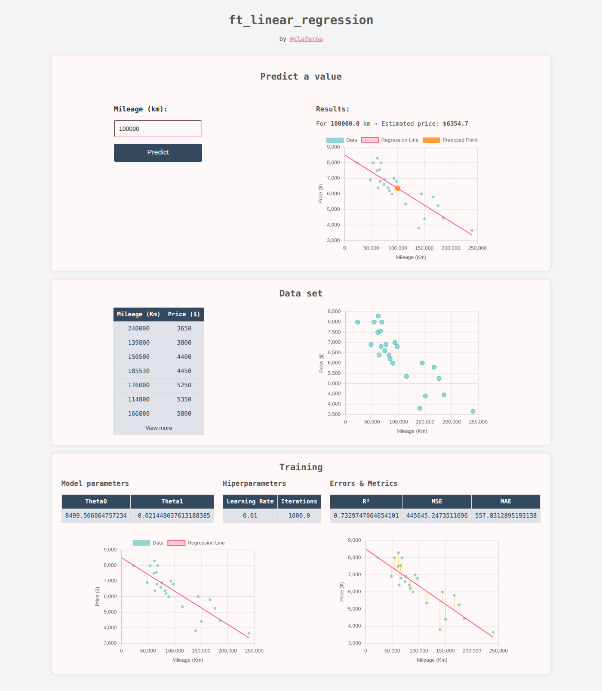

# ft_linear_regression


A minimal, end-to-end implementation of **simple linear regression trained with gradient descent from scratch**.
Predicts a car's price from its mileage, with a small web interface to explore the data, the fitted
line and the model's errors.



## Features

- **Gradient descent from scratch** — no ML library is used to train the model; only NumPy.
- **Feature scaling** — inputs and outputs are standardized (z-score) for stable training, and the
  parameters are converted back to real units for display and prediction.
- **Evaluation metrics** — MSE, MAE and R², reported both during training and in the web app.
- **Interactive web app** — enter a mileage, get an estimated price and see it plotted on the regression line.
- **Visualizations** — raw dataset, fitted line and residuals (the error of each point) rendered with Chart.js.
- **Validation against scikit-learn** — `test.py` compares parameters, metrics and predictions with
  `sklearn.linear_model.LinearRegression`.

## How It Works

The model is a straight line:

```
estimatePrice(mileage) = θ0 + θ1 · mileage
```

Both parameters start at `0` and are updated simultaneously on every iteration using the gradient of the
mean squared error over the `m` training samples:

```
tmpθ0 = learningRate · (1/m) · Σ (estimatePrice(mileage[i]) − price[i])
tmpθ1 = learningRate · (1/m) · Σ (estimatePrice(mileage[i]) − price[i]) · mileage[i]
```

Training runs on standardized data (`learning_rate = 0.01`, `iterations = 1000`). The learned parameters and
metrics are saved to `data/parameters.csv`, which the web app loads to make predictions.

## Project Structure

```
ft_linear_regression/
├── app.py             # Flask web application
├── data.py            # Data loading, scaling and formatting for the UI
├── model.py           # LinearRegression class (gradient descent, metrics, save/load)
├── train.py           # Trains the model and saves the parameters
├── test.py            # Compares the model against scikit-learn
├── data/
│   └── data.csv       # Dataset (km, price)
├── static/            # CSS and JavaScript (Chart.js graphs)
├── templates/         # HTML template (Jinja2)
├── docs/              # README assets
├── Makefile
└── requirements.txt
```

## Getting Started

### Clone the repository

```bash
git clone https://github.com/fernandezclau/ft_linear_regression.git
```

```bash
cd ft_linear_regression
```

### Using the Makefile (Linux/macOS)

```bash
make setup      # Create the virtual environment (.venv)
```

```bash
make install    # Install dependencies
```

```bash
make train      # Train the model and save data/parameters.csv
```

```bash
make run        # Start the web app
```

Other targets: `make test` (compare with scikit-learn), `make clean` (remove the trained parameters),
`make fclean` (also remove the virtual environment and caches) and `make help`.

### Manual setup

```bash
python -m venv .venv
```

```bash
source .venv/bin/activate    # Linux/macOS
```

```bash
.venv\Scripts\activate       # Windows
```

```bash
pip install -r requirements.txt
```

```bash
python train.py
```

```bash
python app.py
```

Then open http://127.0.0.1:5000 in your browser.

> If the model hasn't been trained yet, the web app trains it automatically on first load.

## Why This Project Exists

This is a focused, clean example of implementing a machine learning workflow from scratch, with no
unnecessary libraries or overengineering. It's meant for those who want to understand how each piece fits
together — from raw data to a running app.
